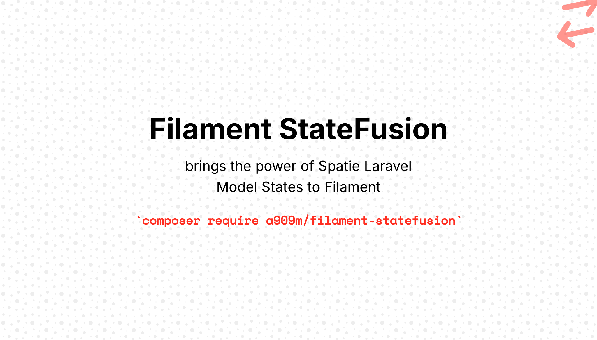

# Filament-StateFusion

[](https://packagist.org/packages/a909m/filament-statefusion)
[](https://github.com/a909m/filament-statefusion/actions?query=workflow%3Arun-tests+branch%3Amain)
[](https://github.com/a909m/filament-statefusion/actions?query=workflow%3A"Fix+PHP+code+styling"+branch%3Amain)
[](https://packagist.org/packages/a909m/filament-statefusion)

**Filament StateFusion** is a powerful [FilamentPHP](https://filamentphp.com/) plugin that seamlessly integrates [Spatie Laravel Model States](https://spatie.be/docs/laravel-model-states) into the Filament admin panel. Effortlessly manage model states, transitions, and filtering within Filament, enhancing both user experience and developer productivity.


Perfect for order processing, publishing workflows, approval systems, and any application requiring well-defined state management.


---

## Features

✨ **Rich State Management**
- Display model states in tables with colors, icons, and descriptions  
- Filter and group records by state
- Transition between states using intuitive UI components
- Bulk state transitions with validation

🛠 **Developer Experience**
- Out-of-the-box support for [Spatie Laravel Model States](https://spatie.be.docs/laravel-model-states)
- Custom transition forms for collecting additional data  
- Automatic state validation and transition rules
- Compatible with Filament v4 dark mode

🎨 **Customizable Interface**
- Custom labels, colors, icons, and descriptions for states
- Custom transition forms and validation
- Flexible attribute mapping for complex models

---


## 🎬 Preview

> 📸 _Screenshots and demo GIFs will be added soon_

---

## Requirements

This plugin is designed to work with the following dependencies:

- PHP: ^8.1
- Laravel: ^10.0|^11.0|^12.0
- Filament: ^3.0|^4.0
- Spatie Laravel Model States: ^2.0


## Installation

Install the package via Composer:

| Plugin Version | Filament Version | Readme |
|----------------|------------------|-------------|
| 1.x            | 3.x              |  [Link](https://github.com/A909M/Filament-StateFusion/main/README.md)      |
| 2.x            | 4.x              |  [Link](https://github.com/A909M/Filament-StateFusion/2.x/README.md)     |


```bash
composer require a909m/filament-statefusion
```

### Upgrading to Filament v4

- `composer require a909m/filament-statefusion:2.0`
- The Action classes were simplified into a single `StateFusionBulkAction` and `StateFusionAction` for pages and tables


Then, implement the `HasFilamentStateFusion` interface and use the `StateFusionInfo` trait on your abstract state class.

Finally, you can start using the components and actions provided by this plugin in your Filament resources.

---


## Getting Started

### 1. Prepare Your State Classes

First, ensure you have [Spatie Laravel Model States](https://spatie.be/docs/laravel-model-states) configured. Then implement the `HasFilamentStateFusion` interface and use the `StateFusionInfo` trait on your **abstract state class**:

```php
<?php
// app/States/OrderState.php
use A909M\FilamentStateFusion\Concerns\StateFusionInfo;
use A909M\FilamentStateFusion\Contracts\HasFilamentStateFusion;
use Spatie\ModelStates\State;
use Spatie\ModelStates\StateConfig;

abstract class OrderState extends State implements HasFilamentStateFusion
{
    use StateFusionInfo;

    public static function config(): StateConfig
    {
        return parent::config()
            ->default(PendingState::class)
            ->allowTransition(PendingState::class, ProcessingState::class)
            ->allowTransition(ProcessingState::class, ShippedState::class)
            ->allowTransition(ShippedState::class, DeliveredState::class)
            ->allowTransition([PendingState::class, ProcessingState::class], CancelledState::class);
    }
}

```

### 2. Configure Your Model

Add the state to your Eloquent model:

```php
<?php
// app/Models/Order.php

use App\Models\States\OrderState;
use Illuminate\Database\Eloquent\Model;
use App\States\OrderState;

class Order extends Model
{
    use HasStates;

    protected $casts = [
        'status' => OrderState::class,
    ];
    
}
```

### 3. Use in Filament Resources

Now you can use StateFusion components in your Filament resources:

```php
// app/Filament/Resources/OrderResource.php
use A909M\FilamentStateFusion\Tables\Columns\StateFusionSelectColumn;
use A909M\FilamentStateFusion\Tables\Filters\StateFusionSelectFilter;
use Filament\Forms\Form;
use Filament\Resources\Resource;
use Filament\Tables\Table;

class OrderResource extends Resource
{
    // ...

    public static function table(Table $table): Table
    {
        return $table
            ->columns([
                StateFusionSelectColumn::make('status'),
            ])
            ->filters([
                StateFusionSelectFilter::make('status'),
            ]);
    }
}
```


## Usage

### Form Components

You can use the following state-aware components in your forms:

- `StateFusionSelect`
- `StateFusionRadio`
- `StateFusionToggleButtons`

```php
use A909M\FilamentStateFusion\Forms\Components\StateFusionSelect;
use A909M\FilamentStateFusion\Forms\Components\StateFusionRadio;
use A909M\FilamentStateFusion\Forms\Components\StateFusionToggleButtons;

// Dropdown select
StateFusionSelect::make('status'),

// Radio buttons with descriptions
StateFusionRadio::make('status'),

// Toggle buttons with colors and icons
StateFusionToggleButtons::make('status'),
```


### Table Columns
---

#### StateFusionSelectColumn
Display state information in your Filament tables and allow for quick state transitions.

```php
use A909M\FilamentStateFusion\Tables\Columns\StateFusionSelectColumn;

StateFusionSelectColumn::make('status'),
```

#### TextColumn
You can also use the standard `TextColumn` to display the state as a badge. When your state classes implement `HasLabel`, `HasColor`, and `HasIcon` interfaces, the badge will automatically display the appropriate label, color, and icon without any additional configuration.

```php
use Filament\Tables\Columns\TextColumn;

TextColumn::make('status')
    ->badge(),
```

### Table Filter

Filter records by state:

```php
use A909M\FilamentStateFusion\Tables\Filters\StateFusionSelectFilter;

StateFusionSelectFilter::make('status'),
```

### Table Actions

#### StateFusionTableAction
Add state transition actions to your table rows.

```php
use A909M\FilamentStateFusion\Tables\Actions\StateFusionTableAction;

StateFusionTableAction::make('approve')
    ->transitionTo(ApprovedState::class),
```

#### StateFusionBulkAction
Transition multiple records at once.

```php
use A909M\FilamentStateFusion\Tables\Actions\StateFusionBulkAction;

StateFusionBulkAction::make('approve')
    ->transition(PendingState::class,ApprovedState::class),
```

### Infolist Entries

#### TextEntry
Similar to the table column, you can use the standard `TextEntry` in your infolists to display the model state as a badge. When your state classes implement `HasLabel`, `HasColor`, and `HasIcon` interfaces, the badge will automatically display the appropriate label, color, and icon without any additional configuration.

```php
use Filament\Infolists\Components\TextEntry;

TextEntry::make('status')
    ->badge(),
```

### Page Actions

#### StateFusionAction
Create actions to transition between states from a page.

```php
use A909M\FilamentStateFusion\Actions\StateFusionAction;

StateFusionAction::make('approve')
    ->transitionTo(ApprovedState::class),
```

---


## Customization

### Custom Attributes

By default, the state components use the first attribute defined in your model's `getDefaultStates()` as the state attribute. If your model uses a different attribute name or you want to specify which attribute to use, you can set it using the `attribute()` method.

```php
// Using a different attribute name
StateFusionSelect::make('approval_status')
    ->attribute('approval_status'),

// Dynamic attribute selection
StateFusionAction::make('transition')
    ->attribute('state')
    ->transitionTo(ApprovedState::class),
```

This is useful when your model has multiple state attributes or you want to reuse the component for different attributes.


### Customizing States

To customize how states appear in the UI, implement the `HasLabel`, `HasDescription`, `HasColor`, or `HasIcon` interfaces on your **concrete state classes**:

```php
use Filament\Support\Colors\Color;
use Filament\Support\Contracts\HasColor;
use Filament\Support\Contracts\HasDescription;
use Filament\Support\Contracts\HasIcon;
use Filament\Support\Contracts\HasLabel;

final class CancelledState extends OrderState implements HasDescription, HasColor, HasIcon, HasLabel
{
    public function getLabel(): string
    {
        return __('Order Cancelled');
    }

    public function getColor(): array
    {
        return Color::Red;
    }

    public function getIcon(): string
    {
        return 'heroicon-o-x-circle';
    }

    public function getDescription(): ?string
    {
        return 'Order cancelled, transaction reversed.';
    }
}
```

### Customizing Transitions

Similarly, transitions can be customized by implementing the same interfaces:

```php
use Filament\Support\Colors\Color;
use Filament\Support\Contracts\HasColor;
use Filament\Support\Contracts\HasIcon;
use Filament\Support\Contracts\HasLabel;
use Spatie\ModelStates\Transition;

final class ToCancelled extends Transition implements HasLabel, HasColor, HasIcon
{
    public function getLabel(): string
    {
        return __('Mark as Cancelled');
    }

    public function getColor(): array
    {
        return Color::Red;
    }

    public function getIcon(): string
    {
        return 'heroicon-o-x-circle';
    }
}
```

### Custom Transitions with Forms

Create transitions that collect additional data:

```php
<?php

use Filament\Forms\Components\{Textarea, DateTimePicker};
use Filament\Support\Contracts\{HasLabel, HasColor, HasIcon};
use Spatie\ModelStates\Transition;

final class ShipOrder extends Transition implements HasLabel, HasColor, HasIcon
{
    private Order $order;

    private array|null $data;

    public function __construct(Order $order, array|null $data = null)
    {
        $this->order = $order;
        $this->data = $data;
    }
    public function getLabel(): string
    {
        return __('Ship Order');
    }

    public function getColor(): string | array
    {
        return Color::Green;
    }

    public function getIcon(): string
    {
        return 'heroicon-o-truck';
    }

    public function form(): array
    {
        return [
            Textarea::make('tracking_number')
                ->label('Tracking Number')
                ->required(),
            
            DateTimePicker::make('shipped_at')
                ->label('Ship Date')
                ->default(now())
                ->required(),
        ];
    }
}
```

---

## Testing

```bash
composer test
```

---

## Changelog

Please see [CHANGELOG](CHANGELOG.md) for more information on what has changed recently.

---

## Contributing

Please see [CONTRIBUTING](.github/CONTRIBUTING.md) for details on how to contribute to this project.

---

## Security Vulnerabilities

Please review [our security policy](../../security/policy) on how to report security vulnerabilities.

---

## Credits

- [A909M](https://github.com/a909m)
- [All Contributors](../../contributors)

---

## License

The MIT License (MIT). Please see [License File](LICENSE.md) for more information.
